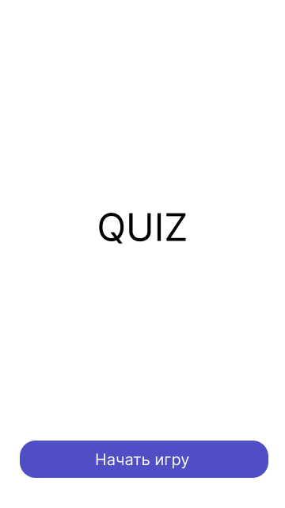
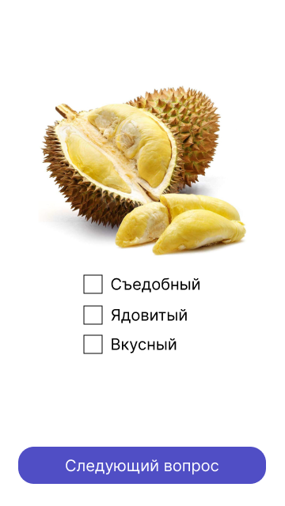
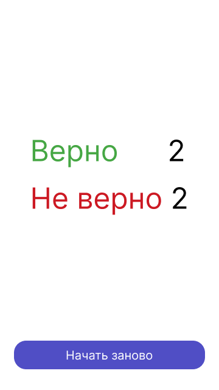

# Лабораторная работа №3. "Базовые UI-компоненты. Жизненный цикл Activity. Навигация на основе Activity, явный Intent"

## Создание базового проекта
1. Выполните fork репозитория https://github.com/chebotarevsa/mad-2023-lab03
2. Выполните клонирование своего репозитория на локальную машину 
3. Создайте новый проект в Android Studio типа "Empty Views Activity"

## Приложение "Quiz" 
Реализуйте приложение  **"Quiz"**. Приложение представляет собой набор экранов с вопросами и
вариантами ответов. Пользователь ответив на один вопрос переходит к следующему, 
последний экран отображает количество верных и не верных ответов.
При разработке Необходимо использовать следующие UI-компоненты:
+ TextView
+ ImageView
+ TextEdit
+ Button
+ Radio Button
+ CheckBox
+ Switch

Каждый экрна приложения должен представлять собой отдельную Activity,
навигация в приложении должна осуществяться с помощью методов startActivity 
или startActivityForResult(устарел, актуально registerForActivityResult) и использовать явные Intents.

Все активности приложения должны "переживать" смену конфигурации (например поворот экрана).

### Начальный экран.
Начальный экран содержит название или логотип приложение и кнопки **"Начать игру"**. 
При нажатии на кнопку начинается сессия вопросов и ответов.
Пример: 

### Вопросы
Вопросы могут быт следующих типов.
+ Требуют ответ "Да" или "Нет" (Selector)
+ Требуют текстовый или цифровой ответ (EditText)
+ Требуют выбрать один из нескольких вариантов ответов (RadioButton)
+ Требуют выбрать несколько вариантов ответов (CheckBox)

Приложение должно содержать не менее 4-х вопросов различный типов.

Для размещения компонентов на макете необходимо использовать компоновщик ConstraintLayout

Пример:

### Результат
Экран результата должен содержать количество верных и не верных ответов, 
а также кнопку "Начать заново" 

## Сдача работы
!!! Срок сдачи работы до 26.10.2023
1. Заполните отчет [REPORT.md](REPORT.md)
2. Выполните commit для фиксации всех изменений
3. Выполнить push для оправки изменений на github.com
4. Создайте Pull Request в репозиторий chebotarevsa/mad-2023-lab03.
   В названии Pull Request укажите группу и свою имя и фамилию, например "123 Иван Иванов"

## Дополнительные материалы
+ https://developer.android.com/guide/components/intents-filters
+ https://developer.alexanderklimov.ru/android/theory/intent.php
+ https://metanit.com/java/android/2.2.php
